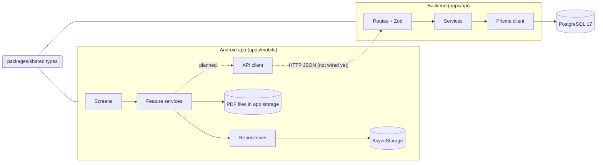
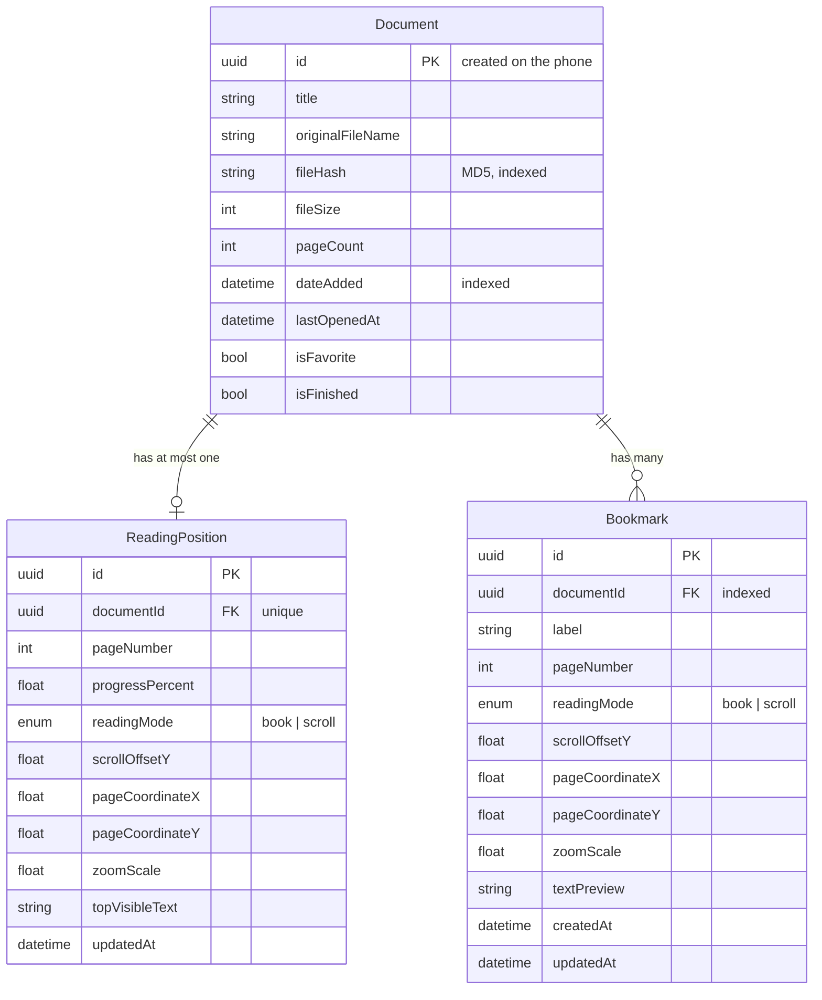

# Architecture

How the system is built and how data moves through it. For the reasons behind these choices, see [DECISIONS.md](DECISIONS.md).

## Overview



**Offline-first.** The app works entirely on the phone: PDFs and their metadata are stored locally. The backend holds a copy for future sync and must never be required for reading. API calls from the app are background work that fails quietly.

**Current state:** the app does not call the API yet. The emulator can reach it (`http://10.0.2.2:3000`), but no app code sends requests. See [ROADMAP.md](ROADMAP.md).

## Repository layout

```
kindle-pdf-reader/
├── apps/
│   ├── api/                  Backend: Fastify + Prisma + PostgreSQL
│   │   ├── prisma/           schema.prisma and migrations/
│   │   ├── prisma7.config.ts Prisma config (non-default name: pass --config)
│   │   └── src/
│   │       ├── app.ts        buildApp(): health routes, route registration
│   │       ├── server.ts     Starts the app on 127.0.0.1:3000
│   │       ├── api.test.ts   API tests (node:test + app.inject)
│   │       ├── db/           prisma.ts: the single PrismaClient
│   │       ├── routes/       HTTP + validation (one file per resource)
│   │       └── services/     Database access + mapping to response shapes
│   └── mobile/               Expo / React Native app (Android first)
│       ├── App.tsx           Navigation stack
│       └── src/
│           ├── app/navigation/        Route param types
│           ├── features/<feature>/    Screens and services per feature
│           ├── database/repositories/ Local storage access
│           └── shared/types/          Re-exports of the shared contract
├── packages/
│   └── shared/               TypeScript types shared by app and API
├── docs/                     This documentation
├── docker-compose.yml        Local PostgreSQL
└── package.json              npm workspaces root (apps/*, packages/*)
```

## Backend (`apps/api`)

| Layer | Location | Responsibility | Must not |
|---|---|---|---|
| App | `src/app.ts` | `buildApp()`: create Fastify, register route plugins, health checks, shutdown hook | Contain resource logic or start listening |
| Server | `src/server.ts` | Call `buildApp()` and listen on port 3000 | |
| Routes | `src/routes/*.ts` | Parse and validate params/query/body with Zod, choose the HTTP status | Query the database |
| Validation helpers | `src/routes/validation.ts` | Shared UUID param schemas and the `toIssues` error formatter | |
| Services | `src/services/*.ts` | Prisma queries, mapping database rows to response objects (DTOs) | Know about HTTP status codes |
| Database | `src/db/prisma.ts` | One `PrismaClient` with the `pg` driver adapter | |

A request flows: `route → validate → service → Prisma → PostgreSQL → service maps row to DTO → route sends status + JSON`.

**Response mapping rules** (applied in every service):
- `null` columns become omitted keys (`value ?? undefined`).
- `Date` columns become ISO strings (`toISOString()`).
- `PUT` writes turn omitted optional fields into `null`, so a replace really clears them.

Endpoints are documented in [API.md](API.md).

## Mobile app (`apps/mobile`)

| Part | Location | Today |
|---|---|---|
| Navigation | `App.tsx`, `src/app/navigation/types.ts` | Native stack: Library → Reader / Bookmarks / Settings, typed params (`documentId`) |
| Library | `src/features/library/screens/LibraryScreen.tsx` | Lists documents, Import button |
| Import | `src/features/import/services/importPdf.ts` | System picker (PDF only) → copy to `Paths.document/pdfs/<id>.pdf` → MD5 hash → reject duplicates → save record |
| Local storage | `src/database/repositories/documentRepository.ts` | The library as one JSON array in AsyncStorage (key `documents`) |
| Reader, Bookmarks, Settings | `src/features/*/screens/` | Placeholders |

Screens never touch storage directly; they go through repositories and feature services. The PDF viewer will be `react-native-pdf` (7.0.1+), which requires a development/EAS build (not Expo Go).

## Shared contract (`packages/shared`)

`packages/shared/src/index.ts` defines `ReadingMode`, `LocalDocument`, `ReadingPosition` and `Bookmark`. Both apps depend on `@kindle-pdf-reader/shared` through npm workspaces.

- The app re-exports `LocalDocument` from it (`src/shared/types/document.ts`).
- The API defines its own response interfaces (`DocumentDTO`, `ReadingPositionDTO`, `BookmarkDTO`) with the same field names. `DocumentDTO` is `LocalDocument` without the device-only `localUri` and `thumbnailUri`.

When a field changes, update `packages/shared`, the API schemas/DTOs and [API.md](API.md) in the same change.

## Data model



- Deleting a document cascades to its reading position and bookmarks (`ON DELETE CASCADE`).
- `Document` also has `createdAt`/`updatedAt` columns that the API does not expose.
- `localUri` and `thumbnailUri` exist only on the phone; the server has no columns for them.
- Bookmarks have one index, `(documentId, pageNumber, createdAt)`, matching the list query's filter and sort.
- Schema source: `apps/api/prisma/schema.prisma`; migrations in `apps/api/prisma/migrations/`.

## Reading position precision

The position fields allow exact restore, but what is filled depends on the viewer. With `react-native-pdf` the app can provide `pageNumber`, `progressPercent`, `readingMode` and `zoomScale`. Restore is exact per page in book mode and lands at the top of the saved page in scroll mode. The other fields stay optional for a future viewer.

## Network

| From | API address |
|---|---|
| The same PC | `http://127.0.0.1:3000` |
| Android emulator on that PC | `http://10.0.2.2:3000` |

The API listens on `127.0.0.1` only and has no authentication or HTTPS. That is fine for local development and must change before anything is deployed.

## Planned: sync

1. After import, and for every document on app start: `PUT /documents/:id` (safe to repeat).
2. When reading: save the position locally first, then `PUT /documents/:id/reading-position` in the background.
3. Bookmarks: save locally with a phone-made UUID, then `PUT /documents/:id/bookmarks/:bookmarkId` (safe to repeat); `DELETE /bookmarks/:bookmarkId` on remove (404 = already gone).
4. Removing from library: delete the local file and record, then `DELETE /documents/:id` (404 = already gone).

Conflict rule for now: the last write wins.
