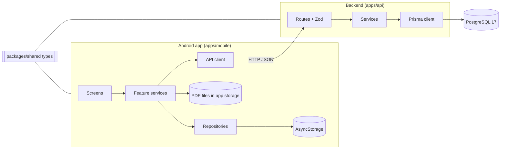
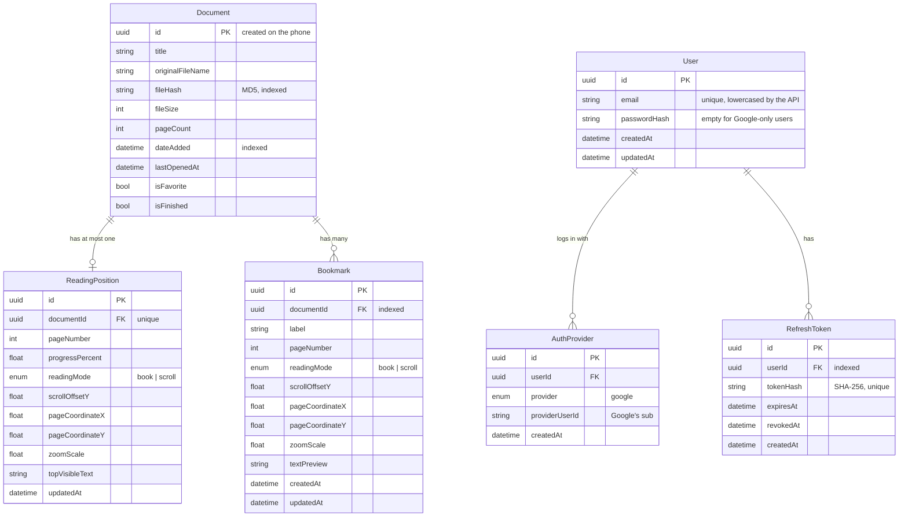

# Architecture

How the system is built and how data moves through it. For the reasons behind these choices, see [DECISIONS.md](DECISIONS.md).

## Overview



**Online-first (D13).** The server holds the library: documents, reading positions, bookmarks and, once uploads exist, the PDF files. The app loads from the API and sends every change to it. The phone keeps a cache, so books already downloaded stay readable offline and offline changes are sent later. Every request belongs to a logged-in user (D14).

**Current state:** the code is still built the offline-first way (D1). The app saves everything on the phone first. In the background it registers documents (library screen) and sends reading positions and bookmarks (reader and bookmarks screens); failures only log a warning. The server has accounts (Step 21), but the app doesn't log in yet (Step 24). Steps 20–25 in [ROADMAP.md](ROADMAP.md) make the switch; the planned design is in [Accounts](#accounts) and [Planned: online-first data flow](#planned-online-first-data-flow).

## Repository layout

```
kindle-pdf-reader/
├── apps/
│   ├── api/                  Backend: Fastify + Prisma + PostgreSQL
│   │   ├── prisma/           schema.prisma and migrations/
│   │   ├── prisma7.config.ts Prisma config (non-default name: pass --config)
│   │   └── src/
│   │       ├── app.ts        buildApp(): error handler, rate-limit plugin, health routes, route registration
│   │       ├── config.ts     Auth settings; refuses to start without a strong JWT_SECRET
│   │       ├── server.ts     Starts the app on 127.0.0.1:3000
│   │       ├── api.test.ts   API tests (node:test + app.inject)
│   │       ├── auth.test.ts  Auth and security tests
│   │       ├── db/           prisma.ts: the single PrismaClient
│   │       ├── routes/       HTTP + validation (one file per resource)
│   │       └── services/     Database access + mapping to response shapes
│   └── mobile/               Expo / React Native app (Android first)
│       ├── App.tsx           Navigation stack
│       └── src/
│           ├── app/navigation/        Route param types
│           ├── features/<feature>/    Screens and services per feature
│           ├── database/repositories/ Local storage access
│           └── shared/types/          Re-exports of the shared contract
├── packages/
│   └── shared/               TypeScript types shared by app and API
├── docs/                     This documentation
├── docker-compose.yml        Local PostgreSQL
└── package.json              npm workspaces root (apps/*, packages/*)
```

## Backend (`apps/api`)

| Layer | Location | Responsibility | Must not |
|---|---|---|---|
| App | `src/app.ts` | `buildApp()`: create Fastify, generic `500` error handler, rate-limit plugin, register route plugins, health checks, shutdown hook | Contain resource logic or start listening |
| Config | `src/config.ts` | Auth settings (token lifetimes, issuer, audience); checks `JWT_SECRET` at startup | |
| Server | `src/server.ts` | Call `buildApp()` and listen on port 3000 | |
| Routes | `src/routes/*.ts` | Parse and validate params/query/body with Zod, choose the HTTP status | Query the database |
| Validation helpers | `src/routes/validation.ts` | Shared UUID param schemas and the `toIssues` error formatter | |
| Auth check | `src/routes/requireAuth.ts` | `authenticate()` reads the Bearer token and returns the user id; `sendUnauthorized()` | Say why a token was rejected |
| Services | `src/services/*.ts` | Prisma queries, mapping database rows to response objects (DTOs) | Know about HTTP status codes |
| Database | `src/db/prisma.ts` | One `PrismaClient` with the `pg` driver adapter | |

A request flows: `route → validate → service → Prisma → PostgreSQL → service maps row to DTO → route sends status + JSON`.

**Response mapping rules** (applied in every service):
- `null` columns become omitted keys (`value ?? undefined`).
- `Date` columns become ISO strings (`toISOString()`).
- `PUT` writes turn omitted optional fields into `null`, so a replace really clears them.

Endpoints are documented in [API.md](API.md).

## Mobile app (`apps/mobile`)

| Part | Location | Today |
|---|---|---|
| Navigation | `App.tsx`, `src/app/navigation/types.ts` | Native stack: Library → Reader / Bookmarks / Settings, typed params (`documentId`; the Reader also takes `pageNumber` and `reloadKey` to open a bookmark) |
| Library | `src/features/library/screens/LibraryScreen.tsx` | Lists documents, Import button |
| Import | `src/features/import/services/importPdf.ts` | System picker (PDF only) → copy to `Paths.document/pdfs/<id>.pdf` → MD5 hash → reject duplicates → save record |
| Local storage | `src/database/repositories/documentRepository.ts` | The library as one JSON array in AsyncStorage (key `documents`) |
| Reader | `src/features/reader/screens/ReaderScreen.tsx` | `react-native-pdf` viewer. Opens at a bookmark's page, else the local position, else the API's. Saves the position on every page change (phone, then API). "Bookmark" button for the current page |
| Bookmarks | `src/features/bookmarks/screens/BookmarkScreen.tsx` | Lists the phone's bookmarks (or the API's if the phone has none), opens one in the reader, deletes on both sides |
| Positions and bookmarks on the phone | `src/database/repositories/readingPositionRepository.ts`, `bookmarkRepository.ts` | AsyncStorage, phone-made UUIDs. `addBookmark` refuses a second bookmark on the same page and mode |
| API client | `src/shared/api/client.ts`, `documentsApi.ts`, `readingPositionsApi.ts`, `bookmarksApi.ts` | `apiRequest` with `ApiError` (has the HTTP status). No login tokens yet (Step 24) |
| Settings | `src/features/settings/screens/` | Placeholder |

Screens never touch AsyncStorage directly; they go through the repositories. **Exception for now:** the reader and bookmarks screens call `src/shared/api/` themselves after saving locally. That moves into the repositories when the app becomes API-first (Step 24). The viewer is `react-native-pdf` 7.0.5, which needs a development build (not Expo Go).

## Shared contract (`packages/shared`)

`packages/shared/src/index.ts` defines `ReadingMode`, `LocalDocument`, `ReadingPosition` and `Bookmark`. Both apps depend on `@kindle-pdf-reader/shared` through npm workspaces.

- The app re-exports `LocalDocument` from it (`src/shared/types/document.ts`).
- The API defines its own response interfaces (`DocumentDTO`, `ReadingPositionDTO`, `BookmarkDTO`) with the same field names. `DocumentDTO` is `LocalDocument` without the device-only `localUri` and `thumbnailUri`.

When a field changes, update `packages/shared`, the API schemas/DTOs and [API.md](API.md) in the same change.

## Data model



- Deleting a document cascades to its reading position and bookmarks (`ON DELETE CASCADE`). Deleting a user cascades to its logins and refresh tokens.
- `AuthProvider` has two unique rules: `(provider, providerUserId)`, so one Google account belongs to one user, and `(userId, provider)`, so a user links at most one account per provider. The second also serves lookups by `userId`.
- The account tables exist but nothing uses them yet (Step 21 adds login). Documents get their owner (`userId`) in Step 22.
- `Document` also has `createdAt`/`updatedAt` columns that the API does not expose.
- `localUri` and `thumbnailUri` exist only on the phone; the server has no columns for them.
- Bookmarks have one index, `(documentId, pageNumber, createdAt)`, matching the list query's filter and sort.
- Schema source: `apps/api/prisma/schema.prisma`; migrations in `apps/api/prisma/migrations/`.

## Reading position precision

The position fields allow exact restore, but what is filled depends on the viewer. With `react-native-pdf` the app can provide `pageNumber`, `progressPercent`, `readingMode` and `zoomScale`. Restore is exact per page in book mode and lands at the top of the saved page in scroll mode. The other fields stay optional for a future viewer.

## Network

| From | API address |
|---|---|
| The same PC | `http://127.0.0.1:3000` |
| Android emulator or USB phone | `http://127.0.0.1:3000`, forwarded to the PC by `adb reverse tcp:3000 tcp:3000` (D16) |

The API listens on `127.0.0.1` only and has no HTTPS. Login exists (`/auth/*`, D15), but only `GET /me` checks it until Step 22. That is fine for local development and must change before anything is deployed.

## Accounts

Both login methods end in the same tokens, so the rest of the API never knows which one was used (D14). Email + password is built (Step 21, `src/routes/auth.ts`, `src/services/auth.ts`); Google comes in Step 23. Endpoints: [API.md](API.md#auth). Security rules: D15.

```
Email + password ──► POST /auth/login ───┐
                                         ├──► access + refresh tokens ──► every API call
Google button ──► Google ID token ──►    │
                  POST /auth/google  ────┘
```

| Table | Holds | Why |
|---|---|---|
| `User` ✅ | id, email (unique, lowercased), `passwordHash` (empty for Google-only users), createdAt | One person is one row, whatever the login method |
| `AuthProvider` ✅ | userId, provider (`google`), providerUserId (unique) | Links a Google account to a user; Apple can be added later without changing `User` |
| `RefreshToken` ✅ | userId, hash of the token, expiresAt, revokedAt | Logout and "log out all devices" revoke rows |
| `Document` | + `userId` (Step 22) | Every library belongs to someone; all queries filter by it |

✅ = in the database since Step 20 (see [Data model](#data-model)).

- **Access token:** JWT, about 15 minutes, sent as `Authorization: Bearer ...`. Checked without a database lookup.
- **Refresh token:** random, about 30 days, stored only as a hash. Each refresh replaces it.
- **On the phone:** both tokens in `expo-secure-store`. `apiRequest` adds the access token and refreshes once on `401`.
- **Routes:** every existing route checks the token and only touches the user's own data.

## Planned: online-first data flow

The repositories stay the only place screens call. What changes is the order inside them (D13):

1. **Library:** load from `GET /documents`, then update the cached copy on the phone. Without a connection, show the cache.
2. **Import:** upload the PDF to the server and register the document. The phone keeps its copy, so it reads offline right away.
3. **Another device:** after login, the library comes from the API; a PDF is downloaded when it is opened.
4. **Positions and bookmarks:** sent to the API (phone-made ids, safe to repeat), and also written to the cache. Saves made offline are queued and sent when the connection returns.
5. **Removing a document:** `DELETE /documents/:id` (404 = already gone), then remove the local file and record.

Conflict rule for now: the server's copy wins, and a queued offline save must not overwrite a newer one. The exact rule is settled when the offline queue is built.
