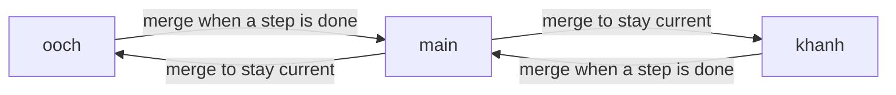

# Team workflow

Who owns what, and how changes move between branches. For setup and commands, see [DEVELOPMENT.md](DEVELOPMENT.md).

## Roles

| Person | Role | Owns |
|---|---|---|
| Anh | Backend lead | `apps/api`, PostgreSQL and Prisma schema, API contracts, `docs/API.md`, sync planning |
| Khanh | Mobile lead | `apps/mobile`: app shell, import, library, reader, book/scroll modes, local position and bookmarks, dark mode, EAS builds and releases |
| Both | | `packages/shared` (the contract), root config, `docs/` |

Change the other person's area only when integration requires it, and tell them.

## Branches

| Branch | Purpose |
|---|---|
| `main` | Integration. Always type-checks and runs. Releases are tagged here. |
| `ooch` | Anh's working branch |
| `khanh` | Khanh's working branch |



Rules:

1. **Never merge `ooch` and `khanh` directly into each other.** Work reaches the other branch only through `main`.
2. **Update your branch from `main` with `git merge main`, not rebase.** Rebasing copies other people's commits and duplicates history.
3. **Never force-push** a branch someone else has pulled.
4. **Merge into `main` often**, at the end of each finished step. The longer a branch lives, the harder its merge.
5. When **both** branches have unmerged work, merge them one at a time and type-check `main` after each.

## Daily loop

```powershell
git checkout ooch            # or khanh
git merge main               # start from the latest shared state
# ... work, commit ...
git push origin ooch

# step finished and checked: integrate
git checkout main
git pull
git merge ooch               # fast-forward if main hasn't moved
git push origin main
git checkout ooch
git merge --ff-only main     # back in sync
```

Merging into `main` when both branches moved is safest in a temporary worktree, so uncommitted work on your own branch is untouched:

```powershell
git worktree add ..\kpr-main-merge main
cd ..\kpr-main-merge
git merge --no-ff origin/khanh
git merge --no-ff ooch
npm ci; npm run typecheck -w apps/api   # and the other checks
cd ..\kindle-pdf-reader
git worktree remove --force ..\kpr-main-merge
git push origin main
```

## Commits

- One logical change per commit, imperative summary, e.g. `Add DELETE /documents/:id`.
- Check `git status` and `git diff --staged` before committing; stage files by name.
- Never commit `.env` files, `node_modules`, `apps/api/generated/` or build output. These are ignored; don't override that.
- Don't mix formatting-only changes into feature commits.

## Changing the contract

The contract is `packages/shared/src/index.ts` plus the API's request and response shapes. In the same change:

1. Update `packages/shared`.
2. Update the API's Zod schemas and DTOs.
3. Update [API.md](API.md).
4. Tell the other person what changed and whether it breaks existing calls.

Adding an optional field is safe. Renaming, removing or making a field required breaks the other side.

## Check-ins

Talk to each other at these points:

| When | Who tells whom | What |
|---|---|---|
| After merging into `main` | Merger → other | What landed; anything to run (`npm ci`, `migrate deploy`, new EAS build) |
| Before changing the contract | Changer → other | The planned change |
| Before choosing a native library | Mobile → backend | Whether it changes what the app can send |
| After a release | Mobile → backend | Version, what to test |

## Releases

Releases are Android APKs built with EAS from `apps/mobile` and attached to a GitHub release.

1. Merge the release work into `main` and check it.
2. Build from that commit: `npm run build:android` in `apps/mobile`.
3. Install the APK on the emulator and smoke-test it.
4. Create the GitHub release with a tag **on that `main` commit** (the tag must point at the code the APK was built from).
5. Mark it as a pre-release while it is an alpha.

Release notes:

```markdown
## PDF Reader vX.Y.Z – <short theme> (Android)

### What works
- ...

### What doesn't work yet
- ...

### Install (Android)
1. Download `<file>.apk` from Assets.
2. Open it on the device or emulator (allow installing unknown apps if asked).
3. Open the app. No development server needed.

### Known issues
- ...
```
